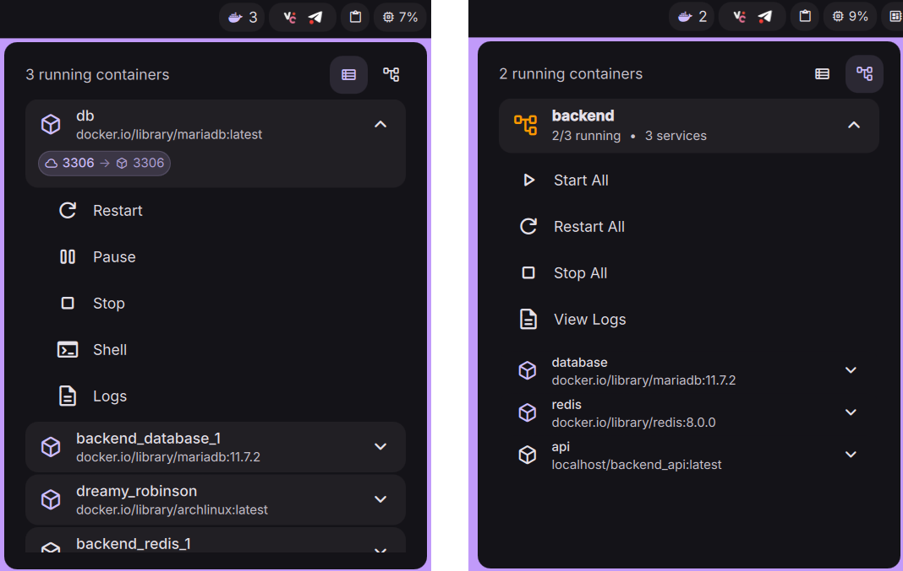

# DMS Docker Manager



Docker container monitoring and management plugin for [DankMaterialShell](https://danklinux.com/)

Inspired by GNOME extension [Easy Docker Containers](https://extensions.gnome.org/extension/2224/easy-docker-containers/)

## Features

- Bar widget displaying Docker status with running container count
- Expandable popout showing all containers
- Docker Compose view for managing compose projects
- Container management: start, stop, restart, pause, unpause
- Terminal access to running containers
- Container log viewing
- `Port mapping display
- Podman support with customizable docker binary
- Auto-refresh using `docker events`

## Installation

### Using DMS cli

```sh
dms plugins install dockerManager
```

### Using DMS Settings

1. Open Settings -> Plugins
2. Click in "Browse"
3. Enable third party plugins
4. Install and enable Docker Manager
5. Add "Docker Manager" to your DankBar widgets list

### Manual

1. Copy plugin directory to `~/.config/DankMaterialShell/plugins/DockerManager`
```sh
git clone https://github.com/LuckShiba/DmsDockerManager ~/.config/DankMaterialShell/plugins/DockerManager
```
2. Open Settings -> Plugins and click in "Scan"
3. Enable "Docker Manager"
4. Add "Docker Manager" to your DankBar widgets list

## Requirements

- Docker or Podman accessible via `docker` command
- User permissions to run Docker commands (make sure your user is added to the `docker` or `podman` group)

## Configuration

Settings available in plugin settings:

- **Docker Binary**: Path to docker or podman binary (default: `docker`)
- **Debounce Delay**: The delay before refreshing the container list after receiving Docker Events (default: `300ms`)
- **Terminal Application**: Command for terminal windows (default: `alacritty --hold`)
- **Shell Path**: Shell for container exec (default: `/bin/sh`)
- **Show Port Mappings**: Toggle display of container port mappings when expanding containers (default: `true`)
- **Auto-scroll on Expand**: Automatically scroll to show expanded content when expanding containers or projects. The scroll smoothly follows the expansion animation to keep the action buttons visible. (default: `true`)

## Usage

Bar widget shows:
- Docker icon (colored: running containers, no color: no containers, red: unavailable)
- Running container count

Click widget to open container list. Expand containers to access actions:
- Start/Restart containers
- Pause/Unpause running containers
- Stop containers
- Open interactive shell
- View logs

If you have a Docker Compose project, you can select in the widget to manage the Compose projects instead, using the selector on the top-right.

### Keyboard Navigation

The Docker Manager supports keyboard navigation when the popout is open:

**Basic Navigation:**
- `Up/Down` or `Ctrl+K/J` or `Ctrl+P/N` or `Tab/Shift+Tab` - Navigate between items
  - In **Container View**: Navigate through all containers
  - In **Compose View**: Navigate through projects and their nested containers hierarchically
- `Enter` or `Space` - Expand/collapse the selected container/project, or execute the selected action when in action menu
- `Left Arrow` or `Ctrl+H` - Collapse the selected container/project when in main list

**Action Menu Navigation:**
- `Right Arrow` or `Ctrl+L` - Enter action menu for the currently selected container/project (expands first if collapsed)
- `Up/Down` - Navigate between action buttons when inside action menu
- `Left Arrow` or `Ctrl+H` - Exit action menu and return to main list
- `Enter` or `Space` - Execute the currently selected action

**View Mode:**
- `V` - Toggle between Container view and Compose Project view

